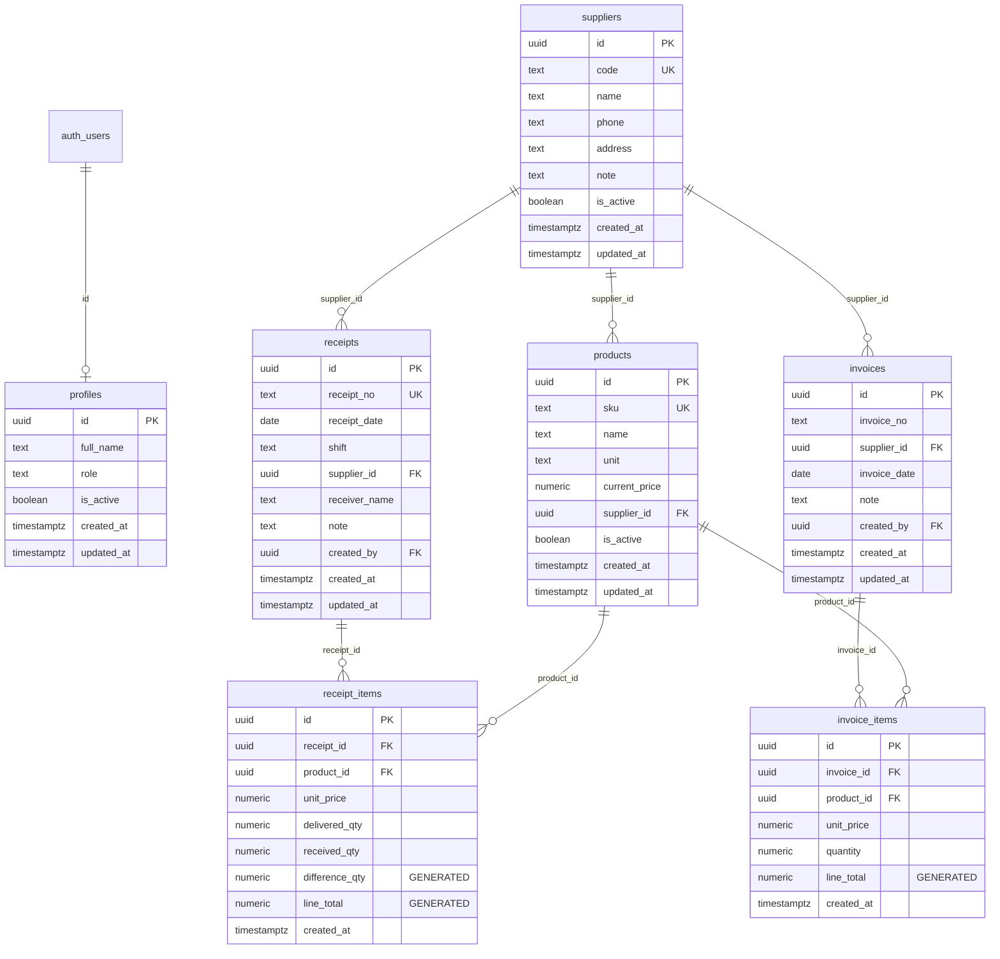

# Database Schema

## Tổng quan

Hệ thống sử dụng Supabase (PostgreSQL) với 7 bảng chính và 2 views tổng hợp.

## ERD



## Bảng chi tiết

### profiles

Lưu thông tin user profile, liên kết với `auth.users`.

| Column | Type | Constraint |
|--------|------|------------|
| id | uuid | PK, FK → auth.users(id) ON DELETE CASCADE |
| full_name | text | NOT NULL |
| role | text | NOT NULL, CHECK IN ('admin', 'staff', 'viewer') |
| is_active | boolean | NOT NULL, DEFAULT true |
| created_at | timestamptz | NOT NULL, DEFAULT now() |
| updated_at | timestamptz | NOT NULL, DEFAULT now(), auto-trigger |

### suppliers

Nhà cung cấp.

| Column | Type | Constraint |
|--------|------|------------|
| id | uuid | PK, DEFAULT gen_random_uuid() |
| code | text | UNIQUE, NOT NULL |
| name | text | NOT NULL |
| phone | text | nullable |
| address | text | nullable |
| note | text | nullable |
| is_active | boolean | NOT NULL, DEFAULT true |
| created_at | timestamptz | NOT NULL, DEFAULT now() |
| updated_at | timestamptz | NOT NULL, DEFAULT now(), auto-trigger |

### products

Sản phẩm, thuộc về một nhà cung cấp.

| Column | Type | Constraint |
|--------|------|------------|
| id | uuid | PK, DEFAULT gen_random_uuid() |
| sku | text | UNIQUE, NOT NULL |
| name | text | NOT NULL |
| unit | text | NOT NULL |
| current_price | numeric(15,2) | NOT NULL, DEFAULT 0 |
| supplier_id | uuid | NOT NULL, FK → suppliers(id) |
| is_active | boolean | NOT NULL, DEFAULT true |
| created_at | timestamptz | NOT NULL, DEFAULT now() |
| updated_at | timestamptz | NOT NULL, DEFAULT now(), auto-trigger |

**Indexes:** `sku`, `supplier_id`

### receipts

Phiếu nhập hàng (phiếu giao nhận).

| Column | Type | Constraint |
|--------|------|------------|
| id | uuid | PK, DEFAULT gen_random_uuid() |
| receipt_no | text | UNIQUE, NOT NULL |
| receipt_date | date | NOT NULL |
| shift | text | NOT NULL, CHECK IN ('morning', 'afternoon') |
| supplier_id | uuid | NOT NULL, FK → suppliers(id) |
| receiver_name | text | NOT NULL |
| note | text | nullable |
| created_by | uuid | FK → profiles(id) |
| created_at | timestamptz | NOT NULL, DEFAULT now() |
| updated_at | timestamptz | NOT NULL, DEFAULT now(), auto-trigger |

**Indexes:** `receipt_date`, `supplier_id`, `shift`, composite `(receipt_date, supplier_id)`

> **Lưu ý:** Không có unique constraint `(receipt_date, supplier_id, shift)` — một ngày + NCC + ca có thể có nhiều phiếu.

### receipt_items

Chi tiết hàng trong phiếu nhập.

| Column | Type | Constraint |
|--------|------|------------|
| id | uuid | PK, DEFAULT gen_random_uuid() |
| receipt_id | uuid | NOT NULL, FK → receipts(id) ON DELETE CASCADE |
| product_id | uuid | NOT NULL, FK → products(id) |
| unit_price | numeric(15,2) | NOT NULL |
| delivered_qty | numeric(15,2) | NOT NULL, DEFAULT 0 |
| received_qty | numeric(15,2) | NOT NULL, DEFAULT 0 |
| difference_qty | numeric(15,2) | **GENERATED** = `received_qty - delivered_qty` |
| line_total | numeric(15,2) | **GENERATED** = `received_qty * unit_price` |
| created_at | timestamptz | NOT NULL, DEFAULT now() |

**Unique:** `(receipt_id, product_id)`
**Index:** `product_id`

### invoices

Hóa đơn từ nhà cung cấp.

| Column | Type | Constraint |
|--------|------|------------|
| id | uuid | PK, DEFAULT gen_random_uuid() |
| invoice_no | text | NOT NULL |
| supplier_id | uuid | NOT NULL, FK → suppliers(id) |
| invoice_date | date | NOT NULL |
| note | text | nullable |
| created_by | uuid | FK → profiles(id) |
| created_at | timestamptz | NOT NULL, DEFAULT now() |
| updated_at | timestamptz | NOT NULL, DEFAULT now(), auto-trigger |

**Unique:** `(supplier_id, invoice_no)`
**Indexes:** `invoice_date`, `supplier_id`

Cột bổ sung ở các phase sau (tóm tắt): snapshot tài chính UP2 (`subtotal`, `discount_*`, `vat_*`, `final_amount` — migration 00022) và nguồn hóa đơn INV-FROM-RECEIPTS (migration 00034):

| Column | Type | Constraint |
|--------|------|------------|
| source_type | text | NOT NULL, DEFAULT `'manual'`, CHECK IN (`manual`, `from_receipts`) |
| receipt_start_date | date | nullable; bắt buộc khi `source_type = 'from_receipts'` |

`invoice_date` = ngày trên hóa đơn NCC. `receipt_start_date` = ngày hàng về sớm nhất trong các ngày đã liên kết — chỉ là mốc nghiệp vụ, **không** phải khoảng truy vấn. Xem [invoice-from-receipts.md](invoice-from-receipts.md).

**Unique bổ sung:** `(id, supplier_id)` — đích của FK kép từ `invoice_receipt_days`.

### invoice_receipt_days

Các ngày hàng về (daily group `supplier_id + receipt_date`) đã dùng để tạo một hóa đơn `from_receipts`.

| Column | Type | Constraint |
|--------|------|------------|
| id | uuid | PK, DEFAULT gen_random_uuid() |
| invoice_id | uuid | NOT NULL |
| supplier_id | uuid | NOT NULL, FK → suppliers(id) |
| receipt_date | date | NOT NULL |
| created_at | timestamptz | NOT NULL, DEFAULT now() |

**FK kép:** `(invoice_id, supplier_id)` → `invoices(id, supplier_id)` ON DELETE CASCADE — DB tự đảm bảo NCC của ngày liên kết = NCC của hóa đơn, và xóa hóa đơn thì các ngày được giải phóng.
**Unique:** `(supplier_id, receipt_date)` — một daily group chỉ thuộc tối đa một hóa đơn.
**Indexes:** `invoice_id`, `supplier_id`, `receipt_date`
**RLS:** SELECT/INSERT cho `authenticated`; không có UPDATE/DELETE policy (chỉ xóa qua cascade).

### invoice_items

Chi tiết hàng trong hóa đơn.

| Column | Type | Constraint |
|--------|------|------------|
| id | uuid | PK, DEFAULT gen_random_uuid() |
| invoice_id | uuid | NOT NULL, FK → invoices(id) ON DELETE CASCADE |
| product_id | uuid | NOT NULL, FK → products(id) |
| unit_price | numeric(15,2) | NOT NULL |
| quantity | numeric(15,2) | NOT NULL |
| line_total | numeric(15,2) | **GENERATED** = `quantity * unit_price` |
| created_at | timestamptz | NOT NULL, DEFAULT now() |

**Unique:** `(invoice_id, product_id, unit_price)` (từ migration 00034; trước đó là `(invoice_id, product_id)`). Hóa đơn `from_receipts` có thể có cùng SKU ở nhiều dòng giá khác nhau. Hóa đơn `manual` vẫn chỉ 1 dòng/SKU — do schema zod của server action kiểm tra.
**Index:** `product_id`

## Generated Columns

Các cột tính toán sử dụng `GENERATED ALWAYS AS ... STORED` để đảm bảo tính toàn vẹn dữ liệu:

| Table | Column | Formula |
|-------|--------|---------|
| receipt_items | difference_qty | `received_qty - delivered_qty` |
| receipt_items | line_total | `received_qty * unit_price` |
| invoice_items | line_total | `quantity * unit_price` |

Không thể INSERT/UPDATE trực tiếp vào các cột này — PostgreSQL tự tính.

## Tổng hợp theo ngày (Daily Aggregation)

### Nguyên tắc

- **Không tạo table** cho dữ liệu "cả ngày"
- Dữ liệu gốc chỉ lưu phiếu sáng (morning) và phiếu chiều (afternoon)
- **Cả ngày tính động** qua SQL views

### View: v_daily_receipt_summary

Tổng hợp **supplier-level** theo ngày.

```
GROUP BY: receipt_date, supplier_id
```

| Field | Mô tả |
|-------|-------|
| receipt_date | Ngày nhập |
| supplier_id | NCC |
| supplier_name | Tên NCC |
| morning_delivered/received/difference_qty | Số lượng ca sáng |
| morning_total_amount | Tiền ca sáng |
| afternoon_delivered/received/difference_qty | Số lượng ca chiều |
| afternoon_total_amount | Tiền ca chiều |
| total_delivered/received/difference_qty | Tổng cả ngày |
| total_amount | Tổng tiền |
| vat_amount | VAT = total_amount × 8% |
| grand_total | total_amount + vat_amount |

### View: v_daily_receipt_product_summary

Tổng hợp **product-level** theo ngày + NCC + sản phẩm.

```
GROUP BY: receipt_date, supplier_id, product_id
```

| Field | Mô tả |
|-------|-------|
| receipt_date | Ngày nhập |
| supplier_id | NCC |
| product_id, sku, product_name, unit | Thông tin sản phẩm |
| morning_delivered/received_qty, morning_line_total | Ca sáng |
| afternoon_delivered/received_qty, afternoon_line_total | Ca chiều |
| total_delivered/received_qty, total_difference_qty, total_line_total | Cả ngày |

### Kỹ thuật pivot

Sử dụng PostgreSQL `FILTER (WHERE ...)` để pivot sáng/chiều trong cùng một query:

```sql
SUM(ri.delivered_qty) FILTER (WHERE r.shift = 'morning') AS morning_delivered_qty
```

Ưu điểm: một lần scan, không cần self-join hay subquery.

## Row Level Security (RLS)

RLS được bật cho tất cả bảng. Policies hiện tại cho phép tất cả `authenticated` users truy cập. Sẽ được tinh chỉnh theo role khi implement auth.

## Migration Files

| File | Nội dung |
|------|----------|
| `00001_initial_schema.sql` | Tất cả tables, triggers, indexes, RLS policies, views |
| `00002_seed_data.sql` | 2 suppliers + 4 products |
| … | (00003–00033: xem header comment của từng file) |
| `00034_invoice_from_receipts.sql` | `invoices.source_type`/`receipt_start_date`, bảng `invoice_receipt_days`, khóa sửa hàng về đã lập HĐ (trigger), RPC `create_invoice_from_receipts` / `update_invoice_from_receipts_header` / `get_receipt_days_invoice_lines`, `v_outstanding` rẽ nhánh theo nguồn + trạng thái `complete` |
| `00035_invoice_receipt_days_single_fk.sql` | Bỏ FK đơn `invoice_id → invoices(id)` thừa (FK kép đã bao gồm) để PostgREST embed không bị mơ hồ |
